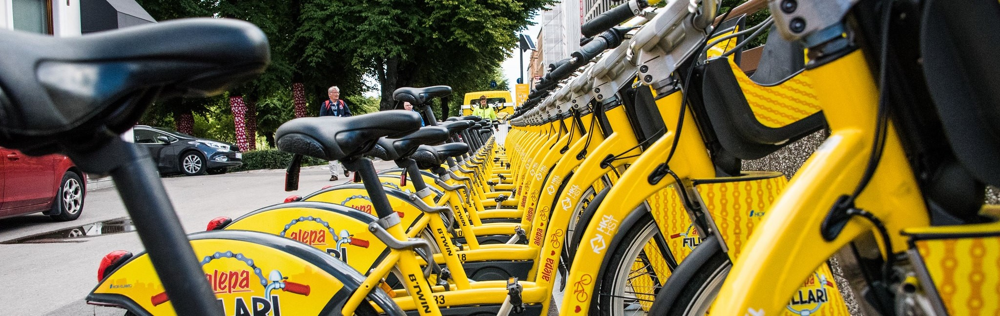

# Exploring urban life through city bike data


A story of urban life in Helsinki and Espoo told by HSL city bike data. The city bikes are share-use bicycles that can be used by anyone.

From the data we find answers to the following questions:
- When is there the most traffic?
- Where do people bike at different times of the day?
- Where do people live and work?
- What are the biggest nightlife areas?


Link to the presentation:
https://github.com/pyrypp/city-bikes/blob/f7ae54f5265cbd7cd12639bd4aedae68dc8c9e27/presentation/CITY%20BIKES%20WRAPPED.pdf

## How it was done

The dataset provided by HSL/City Bike Finland contained the origin and destination of each trip. 
The routes between origin and destination stations were estimated using a library called OSMnx.
It is built on top of NetworkX - a network analysis library.

```
import osmnx as ox
G = ox.graph_from_bbox(bbox, network_type='bike')
routes = ox.shortest_path(G, orig, dest)
```

This allowed us to visualize path usage in a engaging way.


When examining net flow (returns - departures), we noticed two distinct groups of stations.
Some stations see a lot of bikes leaving in the morning and returning in the evening, while others see the opposite.

A k-means clustering algorithm was applied to the data to identify these two groups. 
```
from sklearn.preprocessing import StandardScaler
from sklearn.cluster import KMeans

scaler = StandardScaler()
df.iloc[:,:] = scaler.fit_transform(df)

kmeans = KMeans(n_clusters=2)
kmeans.fit(df)
df["group"] = kmeans.labels_
```

Datasets of sector division in Helsinki and Espoo were acquired. 
Each area was assigned to the group of the nearest station or, if multiple stations were present, a weighted average of their traffic volumes was used.


An approach using Voronoi polygons and Poisson disk sampling was also tried. 
The resulting map was more accurate but not as visually appealing.


The traffic amounts for some stations were very large compared to other stations. In other words, the values of the smaller stations were overwhelmed by the few large stations.
Therefore, a base 2 logarithm was applied to the values to de-emphasize the outliers and make analysis clearer.

## What did I learn?
- Getting more comfortable with geospatial data
  - Libraries (Geopandas, Folium)
  - Streets can be converted to graphs for further network analysis (OSMnx)
  - Fetching data using WFS (OWSlib)
- Areas can be divided based on points using Voronoi polygons
- Poisson disk sampling can be used to create random points that appear evenly spaced
- Basics of K-Means clustering
  - Scikit-learn
  - Data needs to be normalized and symmetrical
- Large computations can be sped up using multiprocessing
  - Batch size needs to be large enough
- Structuring files and code
  - Using clear folder structure for the project
  - Using functions ("Don't repeat yourself")
  - Dividing code into multiple files
  - Importing own modules
  - Creating a main.py file to run everything in the correct order
- A presentation using data storytelling
  - Linking ideas using but and therefore ([Matt Stone and Trey Parker](https://www.youtube.com/watch?v=j9jEg9uiLOU))
  - Reducing clutter and using clear visuals to convey one key message
  - Utilizing colors in a consistent, effective and balanced way (Adobe Color)
  


## Potential next steps
- More temporal analysis (month-to-month, weekdays vs weekends)
- More advanced clustering of stations
- Incorporating external datasets (e.g. weather data, car data)

_Banner image: Ted McGrath/CC BY-NC-SA 2.0_
